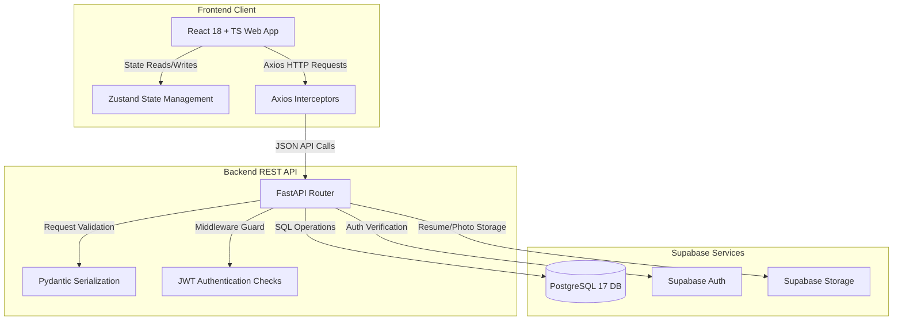

# Hirit

**Simplify your job search, accelerate your career.**

Hirit — a modern full-stack job search and seeker dashboard portal for the Indian market. Zero-brokerage/free job listings, verified candidates, customized profiles, and seeker workspaces. Built by Prakash Software Solutions (PSSPL) with React 18, TypeScript, Vite, FastAPI (Python) & Supabase.

**Website:** [https://www.prakashinfotech.com](https://www.prakashinfotech.com)

[](https://react.dev/)
[](https://fastapi.tiangolo.com/)
[](https://supabase.com/)

---

## 📋 Table of Contents
- [⚠️ The Problem](#the-problem)
- [💡 The Solution](#the-solution)
- [⚙️ Features](#features)
- [🚀 The Hirit Application Lifecycle Flow](#the-hirit-application-lifecycle-flow)
- [📊 Architecture & Application Flow](#architecture--application-flow)
- [📦 Tech Stack](#tech-stack)
- [📋 Prerequisites](#prerequisites)
- [🛠️ Getting Started](#getting-started)
- [🔑 Environment Variables](#-environment-variables)
- [📁 Project Structure](#-project-structure)
- [📡 API Endpoints](#api-endpoints)
- [🧪 Development & Testing](#development)
- [🔒 Security](#security)
- [👥 Contributing](#contributing)
- [📄 License](#license)
- [🏢 About PSSPL](#about-psspl)
- [📬 Contact](#-contact)

---

## The Problem

Recruitment in India is often slow, expensive, and opaque. Job seekers struggle with massive portal subscription fees, unverified job listings, and spam applications, while trying to stand out in crowded candidate pools. Traditional platforms lack structured profiles that combine skills, experience, and verified resume tracking in one place, leaving applicants in the dark about their application status.

## The Solution

Hirit makes the job search process direct, transparent, and functional:
- **Verified Job Listings**: Advanced job search filters based on category, location, salary range, experience level, and remote preferences.
- **Structured Seeker Profiles**: Custom profiles containing educational milestones, work experience history, and verified skills.
- **Resume Uploads**: Integrated storage hosting resume documents (PDF/Word) directly via Supabase Storage.
- **Application Status Tracking**: A unified seeker dashboard to monitor and manage all active job applications.

---

## Features

| Category | Details |
|---|---|
| **Authentication** | Secure signup/login via Supabase Auth with custom JWT session tokens |
| **Profile Manager** | Configure personal bio, location, education history, and work experience milestones |
| **Skills Configuration** | Map professional skills to user profile for simplified profiling |
| **Advanced Job Search** | Filter jobs by title, location, category, remote setup, and salary brackets |
| **Resume Uploads** | Upload and update PDF/Word resumes (max 5MB) securely |
| **Seeker Dashboard** | Monitor application statuses, saved jobs, and profile statistics in one view |
| **Automated Testing** | Comprehensive backend verification suite with isolated database mocks |
| **Responsive UI** | Mobile-first centered layouts with glassmorphic styling |

---

## The Hirit Application Lifecycle Flow

### Step 1: Secure Authentication
1. Users register at `/register` as a **Job Seeker**.
2. **Supabase Auth** creates a user instance, and a database trigger propagates user details into the `public.profiles` table.
3. During login at `/login`, the frontend exchanges credentials with the backend, which returns a JWT access token and a refresh token.
4. Subsequent API calls are secured via FastAPI dependency injection guards (`dependencies.py`), which verify and decode the JWT headers.

### Step 2: Seeker Profile Customization
1. Job Seekers configure their profile at `/profile` by filling in personal details (headline, location, biography, and profile photo).
2. Seekers add structural milestones detailing their **Education History** and **Work Experience** (stored in `public.education` and `public.work_experience` tables).
3. Seekers add professional **Skills** to their profile (propagated to `public.user_skills`).

### Step 3: Job Search
1. Job Seekers search jobs on `/jobs` with advanced filters (keywords, location, category, remote setup, and job types) to discover active opportunities.

### Step 4: Application Submission & Status Tracking
1. When a seeker clicks **Apply**, the frontend uploads their resume file (PDF/Word) to the **Supabase Storage bucket** (`resumes/`).
2. The backend creates an application entry in `public.applications` containing the cover letter, resume bucket URL, expected salary, and notice period.
3. Seekers track the progress of all submitted applications directly from their dashboard.

---

## Architecture & Application Flow

Hirit follows a layered full-stack architecture. The React SPA frontend handles the user experience, the FastAPI backend API handles security and business rules, and the Supabase PostgreSQL database serves as the persistent data layer.



---

## Tech Stack

| Layer | Technology |
|---|---|
| **Frontend** | React 18, TypeScript, Vite 5, Tailwind CSS |
| **UI Components** | Lucide Icons |
| **State Management** | Zustand, React Context API |
| **Backend** | Python 3.11+, FastAPI (v0.111) |
| **Authentication** | JWT Bearer tokens (python-jose) & Supabase Auth |
| **Database** | PostgreSQL 17 (Supabase-hosted) |
| **Object Storage** | Supabase Storage (for resume PDF management) |
| **API Docs** | Swagger UI (FastAPI Auto-Generated) |

---

## Prerequisites

Before you begin, ensure you have the following installed:

| Tool | Version | Download |
|---|---|---|
| **Node.js** | v18+ | [nodejs.org](https://nodejs.org/) |
| **Python** | 3.11+ | [python.org](https://www.python.org/) |
| **Git** | Latest | [git-scm.com](https://git-scm.com/) |
| **Supabase Account** | Free tier | [supabase.com](https://supabase.com/) |

---

## Getting Started

### 1. Clone the Repository

```bash
git clone https://github.com/prakashinfotech/hirit.git
cd hirit
```

### 2. Set Up the Database (Supabase)

1. Create a new project at [supabase.com](https://supabase.com/)
2. Go to **SQL Editor** in your Supabase dashboard
3. Copy the contents of [`backend/schema.sql`](backend/schema.sql) and run it
4. This creates all required tables (profiles, jobs, applications, saved_jobs, education, etc.) and constraints
5. Create a storage bucket in Supabase named `resumes` and set its access policy to public read

### 3. Set Up the Backend (FastAPI)

```bash
cd backend
python -m venv venv
venv\Scripts\activate          # Windows
# source venv/bin/activate     # macOS/Linux

pip install -r requirements.txt
cp .env.example .env
```

Update your `backend/.env` file with your credentials (see [Environment Variables](#-environment-variables) below):

```env
SUPABASE_URL=https://your-project-id.supabase.co
SUPABASE_ANON_KEY=your-supabase-anon-key
SUPABASE_SERVICE_KEY=your-supabase-service-role-key
SECRET_KEY=your-jwt-secret-key-32-chars-minimum
```

Run the backend application server:

```bash
uvicorn app.main:app --reload
```

The API will start at `http://localhost:8000`. Swagger documentation is available at `http://localhost:8000/docs`.

### 4. Set Up the Frontend (React)

```bash
cd ../frontend
npm install
cp .env.example .env
```

Ensure your `frontend/.env` file has the correct endpoints:

```env
VITE_API_URL=http://localhost:8000
VITE_SUPABASE_URL=https://your-project-id.supabase.co
VITE_SUPABASE_ANON_KEY=your-supabase-anon-key
```

Start the React client:

```bash
npm run dev
```

The frontend will start at `http://localhost:5173`.

---

## 🔑 Environment Variables

Every configuration file has a matching `.env.example` template. **Only the `.example` files are committed; the real, filled-in `.env` files are gitignored and must never be pushed.**

### Backend Configurations (`backend/.env`)
| Key | Example / Description |
| :--- | :--- |
| `SUPABASE_URL` | `https://your-project-id.supabase.co` |
| `SUPABASE_ANON_KEY` | `your-supabase-anon-key` |
| `SUPABASE_SERVICE_KEY` | `your-supabase-service-role-key` |
| `SECRET_KEY` | `your-jwt-secret-key-32-chars-minimum` |
| `ALGORITHM` | `HS256` |
| `ACCESS_TOKEN_EXPIRE_MINUTES` | `30` |
| `FRONTEND_URL` | `http://localhost:5173` |

### Frontend Configurations (`frontend/.env`)
| Key | Example / Description |
| :--- | :--- |
| `VITE_API_URL` | `http://localhost:8000` |
| `VITE_SUPABASE_URL` | `https://your-project-id.supabase.co` |
| `VITE_SUPABASE_ANON_KEY` | `your-supabase-anon-key` |

---

## 📁 Project Structure

```
hirit/
├── backend/                     # FastAPI App
│   ├── app/
│   │   ├── main.py              # FastAPI app definition
│   │   ├── config.py            # Environment configurations
│   │   ├── dependencies.py      # Authentication guard middleware
│   │   ├── models/              # Pydantic schemas (user, job, application)
│   │   ├── routers/             # API Router endpoints
│   │   └── services/            # Supabase connection clients
│   ├── tests/                   # pytest suite
│   ├── schema.sql               # Database migration script
│   └── requirements.txt
│
├── frontend/                    # React 18 SPA
│   ├── src/
│   │   ├── api/                 # Axios service layers
│   │   ├── components/          # UI elements and layouts
│   │   ├── context/             # Auth context wrappers
│   │   ├── lib/                 # Configurations & utility functions
│   │   ├── pages/               # Home, Search, Profile, Seeker dashboard
│   │   └── types/               # TypeScript interfaces
│   ├── README.md                # Frontend setup guide
│   └── vite.config.ts
```

---

## API Endpoints

The backend exposes these API groups (see full docs at `/docs`):

| Method | Endpoint | Description |
|---|---|---|
| `POST` | `/api/auth/register` | Register new seeker |
| `POST` | `/api/auth/login` | Login with email + password |
| `GET` | `/api/jobs` | List/search active job postings |
| `GET` | `/api/jobs/{job_id}` | Get job detail |
| `GET` | `/api/users/profile` | Get current user full profile |
| `PUT` | `/api/users/profile` | Update profile fields |
| `POST` | `/api/users/resume/upload` | Upload PDF resume to storage |
| `POST` | `/api/applications/{job_id}` | Submit application for a job |
| `GET` | `/api/applications/my` | Get current user's applications |

---

## Development

### Frontend Commands

```bash
cd frontend
npm run dev          # Start dev server
npm run build        # Production build
npm run typecheck    # TypeScript check
```

### Backend Commands

```bash
cd backend
uvicorn app.main:app --reload    # Start API server
pytest                           # Run test suite
pytest --cov=app                 # Run tests with coverage
```

---

## Security

- **Authentication**: JWT bearer tokens, encrypted password hashing (bcrypt), and authorization guards secure all seeker-scoped endpoints.
- **Data Access**: Parameterized queries and remote client encapsulation secure database transaction paths.
- **Secrets**: No secrets are committed. `.env` files are git-ignored; local development uses environment files, and templates with placeholders are tracked as `.env.example`.
- **Reporting**: To report a vulnerability, please follow [SECURITY.md](SECURITY.md) rather than opening a public issue.

---

## Optional Deployment

This showcase repository has **no active GitHub Actions deployment workflow**, so normal pushes do not deploy the application or require cloud secrets.

---

## Contributing

Contributions are welcome. Please read [CONTRIBUTING.md](CONTRIBUTING.md) for setup, quality checks, and the pull-request process.

1. Fork the repository
2. Create a feature branch (`git checkout -b feature/amazing-feature`)
3. Commit your changes (`git commit -m 'Add amazing feature'`)
4. Push to the branch (`git push origin feature/amazing-feature`)
5. Open a Pull Request

---

## License

Licensed under the [MIT License](LICENSE). © 2026 Prakash Software Solutions Pvt. Ltd.

---

## About PSSPL

**Prakash Software Solutions Pvt. Ltd. (PSSPL)** is an enterprise AI and software engineering company with 26+ years of experience, delivering solutions across Artificial Intelligence, Generative AI, Microsoft Azure, Data & AI, and enterprise application development (.NET, React, SQL, Cloud). Hirit is one of our engineering showcases, demonstrating end-to-end full-stack product delivery.

## 📬 Contact

- 🌐 Website: [www.prakashinfotech.com](https://www.prakashinfotech.com)
- 💼 LinkedIn: [Prakash Software Solutions](https://www.linkedin.com/company/prakash-software-solutions-pvt-ltd)
- ✉️ Email: info@prakashinfotech.com

---

**Built with ❤️ for the Indian recruitment market by [Prakash Software Solutions (PSSPL)](https://www.prakashinfotech.com)**
