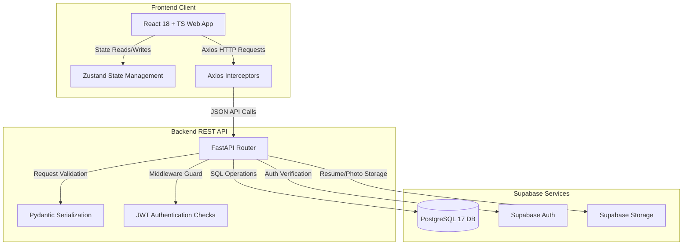

# 🚀 Hirit — Job Portal Platform

[](#)
[](frontend)
[](backend)
[](backend/schema.sql)

Welcome to **Hirit** (pronounced *Hire-it*), a full-stack job search and applicant tracking platform. This repository hosts a job seeker portal platform focusing on advanced job search, resume uploads, and application tracking. This platform is built with **FastAPI**, **React 18 (TypeScript)**, and **Supabase (PostgreSQL 17, Auth, and Storage)**.

---

## 📋 Table of Contents
- [🚀 The Hirit Application Lifecycle Flow](#-the-hirit-application-lifecycle-flow)
- [📊 System Architecture Diagram](#-system-architecture-diagram)
- [📦 Tech Stack](#-tech-stack)
- [🗂️ Project Structure](#%EF%B8%8F-project-structure)
- [🛠️ Database Setup & Schema Migrations](#%EF%B8%8F-database-setup--schema-migrations)
- [⚙️ Setup & Installation](#%EF%B8%8F-setup--installation)
- [🔑 Environment Variables](#-environment-variables)
- [🔐 Local Dev Accounts](#-local-dev-accounts)
- [🧪 Running Tests](#-running-tests)
- [🔒 Security & Credential Hygiene](#-security--credential-hygiene)
- [📌 Project Status](#-project-status)

---

## 🚀 The Hirit Application Lifecycle Flow

### Step 1: Secure Authentication
1. Users register at `/register` as a **Job Seeker**.
2. **Supabase Auth** creates a user instance, and a database trigger propagates user details into the `public.profiles` table.
3. During login at `/login`, the frontend exchanges credentials with the backend, which returns a JWT access token and a refresh token.
4. Subsequent API calls are secured via FastAPI dependency injection guards (`dependencies.py`), which verify and decode the JWT headers.

### Step 2: Seeker Profile Customization
1. Job Seekers configure their profile at `/profile` by filling in personal details (headline, location, biography, and profile photo).
2. Seekers add structural milestones detailing their **Education History** and **Work Experience** (stored in `public.education` and `public.work_experience` tables).
3. Seekers add professional **Skills** to their profile (propagated to `public.user_skills`).

### Step 3: Job Search
1. Job Seekers search jobs on `/jobs` with advanced filters (keywords, location, category, remote setup, and job types) to discover active opportunities.

### Step 4: Application Submission & Status Tracking
1. When a seeker clicks **Apply**, the frontend uploads their resume file (PDF/Word) to the **Supabase Storage bucket** (`resumes/`).
2. The backend creates an application entry in `public.applications` containing the cover letter, resume bucket URL, expected salary, and notice period.
3. Seekers track the progress of all submitted applications directly from their dashboard.

---

## 📊 System Architecture Diagram



---

## 📦 Tech Stack

### Backend API
* **FastAPI (v0.111)**: Async REST framework.
* **Uvicorn (v0.29)**: ASGI server with reload utility.
* **Pydantic (v2.7)**: Serialization and request-body validation.
* **Supabase Python SDK (v2.4.6)**: Remote database and auth SDK.

### Frontend Client
* **React 18 + TypeScript + Vite**: Responsive SPA interface.
* **Tailwind CSS**: Core glassmorphic design system.
* **TanStack Query v5**: Server-state management and caching.
* **Zustand**: Client state store.
* **Lucide React**: Clean icons.

### Database & Storage
* **Supabase (PostgreSQL 17)**: High-performance relational database with **Row Level Security (RLS)** active on all 16 tables.
* **Supabase Storage**: Object storage buckets for resumes and profile photos.

---

## 🗂️ Project Structure

```
hirit/
├── backend/
│   ├── app/
│   │   ├── main.py               # FastAPI app definition
│   │   ├── config.py             # Environment configurations
│   │   ├── dependencies.py       # Authentication guard middleware
│   │   ├── models/               # Pydantic data schemas
│   │   ├── routers/              # Modular route endpoints
│   │   └── services/             # Supabase clients
│   ├── tests/                    # pytest backend test suite
│   ├── schema.sql                # Complete database migration script
│   └── requirements.txt
│
├── frontend/
│   ├── src/
│   │   ├── api/                  # Axios HTTP client endpoints
│   │   ├── components/           # UI elements and layouts
│   │   ├── context/              # Authentication context API
│   │   ├── lib/                  # Utility config and helper scripts
│   │   ├── pages/                # Home, Search, Detail, Dashboards
│   │   └── types/                # TypeScript interface type definitions
│   ├── README.md                 # Frontend installation guide
│   └── vite.config.ts
```

---

## 🛠️ Database Setup & Schema Migrations

The database consists of **11 tables** managed securely in Supabase.

### Schema Deployment Step
1. Go to your **Supabase Dashboard** -> **SQL Editor**.
2. Create a new query, paste the full contents of the database migration script: [backend/schema.sql](backend/schema.sql).
3. Execute the query. This sets up all primary tables, constraints, foreign keys, and RLS guidelines.

---

## ⚙️ Setup & Installation

### Prerequisites
- Python 3.11+
- Node.js 18+
- Active Supabase Project
- Git

### 1. Clone the Repository
```bash
git clone https://github.com/Vermaakshita/hirit-job-portal.git
cd hirit-job-portal
```

### 2. Database Schema Setup
Deploy the database tables before launching the services:
1. Go to your **Supabase Dashboard** -> **SQL Editor**.
2. Create a new query and paste the complete content of [backend/schema.sql](backend/schema.sql).
3. Click **Run** to execute the query and initialize the 11 database tables and constraints.

### 3. Backend Service Setup
```bash
cd backend
python -m venv venv
venv\Scripts\activate          # Windows
# source venv/bin/activate     # macOS/Linux

pip install -r requirements.txt
cp .env.example .env
```
Update your `backend/.env` file with your Supabase and security credentials (see [Environment Variables](#-environment-variables) below for details).

Start the FastAPI application:
```bash
uvicorn app.main:app --reload
```
API Swagger Documentation: `http://localhost:8000/docs`

### 4. Frontend Client Setup
```bash
cd ../frontend
npm install
cp .env.example .env
```
Update your `frontend/.env` file (see [Environment Variables](#-environment-variables) below for details).

Start the React development server:
```bash
npm run dev
```
Access the application at: `http://localhost:5173`

---

## 🔑 Environment Variables

Every configuration file has a matching `.env.example` template: `backend/.env.example` and `frontend/.env.example`. Only the `.example` files are committed; the real, filled-in `.env` files are gitignored and must never be pushed to public repositories.

### Backend Configurations (`backend/.env`)
| Key | Example / Description |
| :--- | :--- |
| `SUPABASE_URL` | `https://your-project-id.supabase.co` |
| `SUPABASE_ANON_KEY` | `your-supabase-anon-key` |
| `SUPABASE_SERVICE_KEY` | `your-supabase-service-role-key` |
| `SECRET_KEY` | `your-jwt-secret-key-32-chars-minimum` |
| `ALGORITHM` | `HS256` |
| `ACCESS_TOKEN_EXPIRE_MINUTES` | `30` (Default JWT token expiry time) |
| `FRONTEND_URL` | `http://localhost:5173` (CORS permitted origin) |

### Frontend Configurations (`frontend/.env`)
| Key | Example / Description |
| :--- | :--- |
| `VITE_API_URL` | `http://localhost:8000` (FastAPI backend base URL) |
| `VITE_SUPABASE_URL` | `https://your-project-id.supabase.co` |
| `VITE_SUPABASE_ANON_KEY` | `your-supabase-anon-key` |

---

## 🔐 Local Dev Accounts

No user credentials or pre-configured accounts are published in this repository. Setup your own local test accounts by signing up through the web application's registration portal at `http://localhost:5173/register` as a **Job Seeker**.

---

## 🧪 Running Tests

Hirit has a comprehensive backend test suite that runs isolated database mocks.

Navigate to the `backend` directory and run the test suite:
```bash
cd backend
pytest
```

**Verify Coverage:**
```bash
pytest --cov=app --cov-report=term-missing
```

All **117 tests** pass cleanly with 100% green integrity status.

---

## 🔒 Security & Credential Hygiene

> [!IMPORTANT]
> - **Environment Files**: `.env` files are ignored by git in [.gitignore](.gitignore). Never force commit them.
> - **Service Role Key**: Keep the `SUPABASE_SERVICE_KEY` strictly inside the backend environment. Never expose it to the frontend codebase.

---

## 📌 Project Status

🚧 **Hirit Job Seeker Portal** — This project is an actively developed demonstration platform. It showcases the core authentication pipeline, frontend components, and dashboard interfaces configured for testing and evaluation of job seeker workflows (such as advanced filtering, resume uploads, and application tracking).
