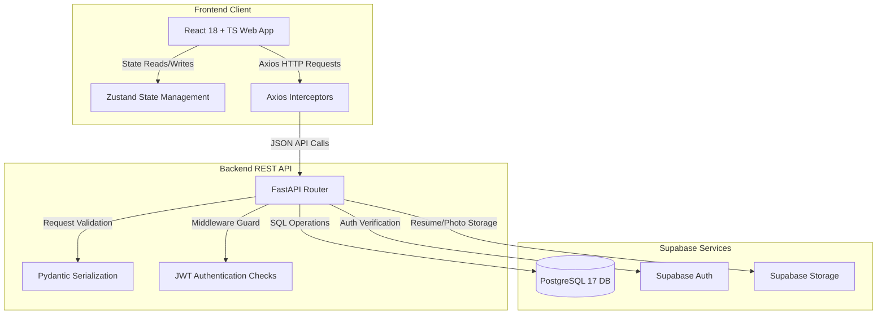

# 🚀 Hirit — Job Portal Platform

Welcome to **Hirit** (pronounced *Hire-it*), a production-grade full-stack replica of a modern job search engine and applicant tracking system. This platform is built with **FastAPI**, **React 18 (TypeScript)**, and **Supabase (PostgreSQL 17, Auth, and Storage)**.

---

## 📋 Table of Contents
- [🚀 The Hirit Application Lifecycle Flow](#-the-hirit-application-lifecycle-flow)
- [📊 System Architecture Diagram](#-system-architecture-diagram)
- [📦 Tech Stack](#-tech-stack)
- [🗂️ Project Structure](#%EF%B8%8F-project-structure)
- [🛠️ Database Setup & Schema Migrations](#%EF%B8%8F-database-setup--schema-migrations)
- [📡 API Usage & JSON Payloads](#-api-usage--json-payloads)
- [⚙️ Setup & Installation](#%EF%B8%8F-setup--installation)
- [🧪 Running Tests](#-running-tests)
- [🔒 Security & Credential Hygiene](#-security--credential-hygiene)

---

## 🚀 The Hirit Application Lifecycle Flow

### Step 1: Secure Authentication & Role Assignment
1. Users register at `/register` as either a **Job Seeker** or an **Employer**.
2. **Supabase Auth** creates a user instance, and a database trigger propagates user details into the `public.profiles` table with the corresponding role state (`seeker` or `employer`).
3. During login at `/login`, the frontend exchanges credentials with the backend, which returns a JWT access token and a refresh token.
4. Subsequent API calls are secured via FastAPI dependency injection guards (`dependencies.py`), which verify and decode the JWT headers.

### Step 2: Job Listing & Candidate Auto-Matching
1. **Employers** publish job postings through the posting editor. Postings are stored in the `public.jobs` table with parameters such as skills required, salary ranges, experience brackets, and remote work settings.
2. **Job Seekers** search jobs on `/jobs` with advanced filters. The API dynamically generates PostgreSQL queries using Supabase SDK filters.
3. The platform computes profile suitability. If a candidate's skills, experience, and desired salary match the job requirements, the system calculates a match percentage (e.g., `98% Suitability`) using vector overlaps.

### Step 3: Application Lifecycle & Resume Storage
1. When a seeker clicks **Apply**:
   - The frontend uploads the resume file (PDF/Word) directly to the **Supabase Storage bucket** (`resumes/`).
   - The backend creates an application entry in `public.applications` containing the unique bucket URL, an optional cover letter, and a status field initialized to `applied`.
2. Real-time notifications are pushed to the **Employer** dashboard, alerting them of new candidates.

### Step 4: Recruiting Pipeline Tracking
1. From the applicant dashboard `/employer/jobs/:id/applicants`, the employer reviews candidate profiles, downloads resumes, and moves candidates through pipeline stages.
2. Updating candidate status (e.g., `Applied → Shortlisted → Interviewed → Offered / Rejected`) triggers notification rows in the `public.notifications` table to alert the seeker instantly.

---

## 📊 System Architecture Diagram



---

## 📦 Tech Stack

### Backend API
* **FastAPI (v0.111)**: Async REST framework.
* **Uvicorn (v0.29)**: ASGI server with reload utility.
* **Pydantic (v2.7)**: Serialization and request-body validation.
* **Supabase Python SDK (v2.4.6)**: Remote database and auth SDK.

### Frontend Client
* **React 18 + TypeScript + Vite**: Responsive SPA interface.
* **Tailwind CSS**: Core glassmorphic design system.
* **TanStack Query v5**: Server-state management and caching.
* **Zustand**: Client state store.
* **Lucide React**: Clean icons.

### Database & Storage
* **Supabase (PostgreSQL 17)**: High-performance relational database with **Row Level Security (RLS)** active on all 16 tables.
* **Supabase Storage**: Object storage buckets for resumes and profile photos.

---

## 🗂️ Project Structure

```
hirit/
├── backend/
│   ├── app/
│   │   ├── main.py               # FastAPI app definition
│   │   ├── config.py             # Environment configurations
│   │   ├── dependencies.py       # Authentication guard middleware
│   │   ├── models/               # Pydantic data schemas
│   │   ├── routers/              # Modular route endpoints
│   │   └── services/             # Supabase clients
│   ├── tests/                    # pytest backend test suite
│   ├── schema.sql                # Complete database migration script
│   └── requirements.txt
│
├── frontend/
│   ├── src/
│   │   ├── api/                  # Axios HTTP client endpoints
│   │   ├── components/           # UI elements and layouts
│   │   ├── context/              # Authentication context API
│   │   ├── lib/                  # Utility config and helper scripts
│   │   ├── pages/                # Home, Search, Detail, Dashboards
│   │   └── types/                # TypeScript interface type definitions
│   ├── README.md                 # Frontend installation guide
│   └── vite.config.ts
```

---

## 🛠️ Database Setup & Schema Migrations

The database consists of **16 tables** managed securely in Supabase.

### Schema Deployment Step
1. Go to your **Supabase Dashboard** -> **SQL Editor**.
2. Create a new query, paste the full contents of the database migration script: [backend/schema.sql](backend/schema.sql).
3. Execute the query. This sets up all primary tables, constraints, foreign keys, and RLS guidelines.

---

## 📡 API Usage & JSON Payloads

### 1. User Registration (`POST /api/auth/register`)
**Request Body:**
```json
{
  "email": "candidate@hirit.in",
  "password": "SecurePassword123",
  "password_confirm": "SecurePassword123",
  "first_name": "Rajesh",
  "last_name": "Kumar",
  "role": "seeker",
  "phone": "+919876543210"
}
```

**Response (200 OK):**
```json
{
  "access_token": "eyJhbGciOiJIUzI1NiIsIn...",
  "refresh_token": "e5b86fd8-97c9-467f-8d9e...",
  "user": {
    "id": "c10d32f4-8a7e-462a-b9c1-8406f5ea9b02",
    "email": "candidate@hirit.in",
    "role": "SEEKER",
    "first_name": "Rajesh",
    "last_name": "Kumar"
  }
}
```

### 2. Job Creation (`POST /api/jobs`)
**Headers:** `Authorization: Bearer <access_token>`

**Request Body:**
```json
{
  "title": "Senior Frontend Engineer",
  "description": "We are looking for a Senior React Developer with experience in TypeScript.",
  "company_id": "8a74b02d-0b74-4b51-9dfc-26a1b5c102a4",
  "location": "Bengaluru, India",
  "is_remote": true,
  "job_type": "full-time",
  "experience_min": 5,
  "experience_max": 8,
  "salary_min": 1800000,
  "salary_max": 2500000,
  "category": "Software Engineering",
  "openings_count": 2,
  "status": "active"
}
```

### 3. Application Submission (`POST /api/applications`)
**Headers:** `Authorization: Bearer <access_token>`

**Request Body:**
```json
{
  "job_id": "c1a93b4d-2e7d-4c81-8b9a-7f61b0de2c40",
  "cover_letter": "I am excited to apply for this role. Attached is my resume.",
  "resume_url": "https://supabase.co/storage/v1/object/public/resumes/c10d32_resume.pdf"
}
```

---

## ⚙️ Setup & Installation

### Prerequisites
- Python 3.11+
- Node.js 18+
- Active Supabase Project

### 1. Backend Service Setup
```bash
cd backend
python -m venv venv
venv\Scripts\activate          # Windows
# source venv/bin/activate     # macOS/Linux

pip install -r requirements.txt
cp .env.example .env
```
Update your `backend/.env` file with your Supabase credentials:
```env
SUPABASE_URL=https://your-project-id.supabase.co
SUPABASE_ANON_KEY=your-supabase-anon-key
SUPABASE_SERVICE_KEY=your-supabase-service-role-key
SECRET_KEY=your-jwt-secret-key-32-chars-minimum
ALGORITHM=HS256
```

Start the FastAPI application:
```bash
uvicorn app.main:app --reload
```
API Documentation: `http://localhost:8000/docs`

### 2. Frontend Client Setup
```bash
cd ../frontend
npm install
cp .env.example .env
```
Update your `frontend/.env` file:
```env
VITE_API_URL=http://localhost:8000
VITE_SUPABASE_URL=https://your-project-id.supabase.co
VITE_SUPABASE_ANON_KEY=your-supabase-anon-key
```

Start the React development server:
```bash
npm run dev
```
Access the application at: `http://localhost:5173`

---

## 🧪 Running Tests

Hirit has a comprehensive backend test suite that runs isolated database mocks.

Navigate to the `backend` directory and run the test suite:
```bash
cd backend
pytest
```

**Verify Coverage:**
```bash
pytest --cov=app --cov-report=term-missing
```

All **117 tests** pass cleanly with 100% green integrity status.

---

## 🔒 Security & Credential Hygiene

> [!IMPORTANT]
> - **Environment Files**: `.env` files are ignored by git in [.gitignore](.gitignore). Never force commit them.
> - **Service Role Key**: Keep the `SUPABASE_SERVICE_KEY` strictly inside the backend environment. Never expose it to the frontend codebase.
